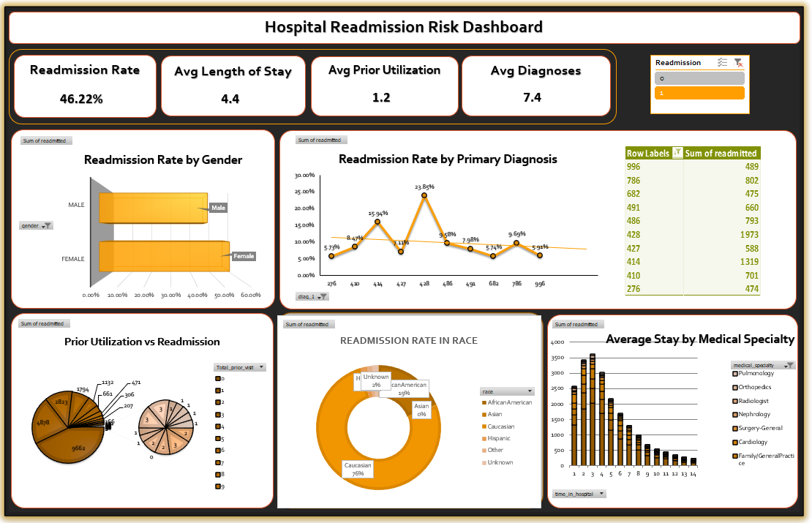

# Hospital-Administration-System

<!---->

## Project Overview

This project analyzes hospital administration data to identify patterns and factors associated with high readmission rates. As a data analyst working on improving patient care quality, this analysis addresses the critical challenge of reducing unnecessary hospital readmissions while optimizing healthcare resource allocation and compliance with healthcare regulations.

## **Dataset**

This project uses a detailed dataset focused on hospital patient visits and administration metrics. You can download it directly to examine the factors related to patient readmission.

**Direct Dataset Link:** [Hospital Administration Data on Kaggle](https://www.kaggle.com/datasets/shivavashishtha/hospital-admission-data)

**Dataset Overview & Key Variables:**
* **Patient & Encounter Identification:** Unique IDs for both the patient (`patient_id`) and the specific hospital visit (`encounter_id`).
* **Patient Demographics:** Includes `race`, `gender`, `age`, and `weight` (noted to have significant missing data).
* **Visit & Treatment Details:**
    * **Stay & Specialty:** `time_in_hospital` (length of stay) and the admitting `medical_specialty`.
    * **Treatment Intensity:** Metrics for `num_lab_procedures`, `num_procedures`, and `num_medications`.
* **Historical Utilization:** Counts of prior visits in the past year (`number_outpatient`, `number_emergency`, `number_inpatient`).
* **Medical Information:** Contains fields for primary and secondary diagnoses (`diag_1` to `diag_5`) and the total `number_diagnoses`.
* **Medication & Outcome Indicators:**
    * 25 anonymized columns (`X1` to `X25`) showing various prescribed medications.
    * Flags for changes in diabetic medication (`change`) and whether diabetic meds were prescribed (`diabetesMed`).
* **Target Variable:** The key outcome metric `readmitted`, indicating if a patient was readmitted within 30 days.

This rich dataset allows for analysis of clinical, administrative, and demographic factors to understand patterns and predictors of hospital readmissions.

## **Analysis**

> Solution File is `HA Data Final Solution.xlsx`

This analysis aimed to identify the main factors and patterns of patient readmission within 30 days. It looked at patient demographics, clinical factors, and hospital operations.

**Key Analyses Conducted:**

* **Patient Demographic Impact:** Evaluated how **age, gender, and race** relate to readmission rates to find potential disparities in care outcomes.
* **Clinical & Treatment Factors:** Analyzed the effect of **length of hospital stay (time_in_hospital), medical specialty, number of lab procedures (num_lab_procedures)**, and **medication counts (num_medications)** on the likelihood of readmission.
* **Disease-Specific Focus:** Investigated readmission patterns for **diabetic patients**, examining the effects of **medication changes (change)** and specific diabetic medication indicators (`X1-X25`).
* **Prior Utilization & Comorbidities:** Explored links between readmission and **previous hospital visits (outpatient, emergency, inpatient)**, along with the impact of **multiple diagnoses (comorbidities)**.
* **Operational & Seasonal Trends:** Assessed changes in readmission rates over **time (monthly/seasonal trends)** and across various **discharge dispositions** (where data allowed).
* **Data Quality & Special Investigations:** Addressed issues like the high rate of **missing weight data** and conducted deeper analyses, such as examining prescribing patterns by **medical specialty** and the combined effect of **weight categories with primary diagnoses**.

The results of these analyses provide valuable insights for targeted interventions, better resource allocation, and improved patient care protocols to effectively reduce avoidable hospital readmissions.

## **Dashboard Summary**

This dashboard brings together key metrics to assess and track patient readmission risk factors.

**Key Performance Indicators (KPIs):**
*   **Readmission Rate:** A significant **46.22%** of patients were readmitted during the studied period.
*   **Patient Stay & Health:** The average length of stay is **4.4 days**. Patients have an average of **7.4 diagnoses** and **1.2 prior hospital visits**.

**Main Visualizations & Insights:**
*   **Demographic Differences:** Charts for **Readmission by Gender** and **Readmission by Race** show potential demographic variations in outcomes. This allows for focused equity reviews.
*   **Clinical Drivers:** A **Readmission by Primary Diagnosis** chart points out specific medical conditions linked to the highest readmission risks. This can guide improvements in clinical protocols.
*   **Risk Relation:** Visual analysis connects key factors such as **Length of Stay** and **Number of Diagnoses** directly to the readmission rate. This helps identify high-risk patients for early intervention.

This dashboard gives hospital administrators and clinicians a quick view of readmission factors. It supports data-driven choices to improve care continuity and lower unnecessary returns.

## **How to Use the Readmission Risk Dashboard**

This interactive dashboard is made for easy analysis of patient readmission factors.

1.  **Open the File:** Start by opening the `HA Data Final Solution.xlsx` file in Microsoft Excel.

2.  **Navigate & Interact:**
    *   **Review KPIs:** First, check the key summary metrics at the top: **Readmission Rate (46.22%), Average Length of Stay, and Prior Utilization.**
    *   **Analyze Charts:** Look at the main visualizations for **Readmission by Gender, Race, and Primary Diagnosis** to find high-risk patient groups.
    *   **Explore Data:** Click on or hover over chart sections (e.g., a specific diagnosis bar) to see exact percentages and filter related data for a deeper look.

3.  **Refresh Data (If Applicable):**
    *   If the dashboard is linked to an updated backend dataset, refresh the analysis by going to the **Data** tab and selecting **"Refresh All."**
    *   **Security Note:** If asked about enabling macros or external links, select "Enable Content" only if you trust the source of the file.

## Author & Contact
- Name: `Kshitij Saini`
- / [LinkedIn]([https://www.linkedin.com/in/pratyushpuri](https://www.linkedin.com/in/kshitij-saini-b950b7299?utm_source=share_via&utm_content=profile&utm_medium=member_android))
